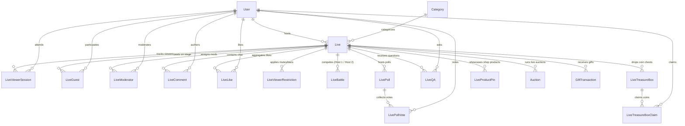

# Lives — Database Architecture & Schema Reference

> **Audience:** Backend Engineers, Mobile App Engineers, Data Engineers, and DB Administrators.  
> **Source of Truth:** [`prisma/schema.prisma`](../../prisma/schema.prisma)  
> **Database:** PostgreSQL  
> **Related:** [logic.md](./logic.md) · [endpoints.md](./endpoints.md) · [tasks.md](./tasks.md)

---

## Table of Contents

1. [Entity Relationship Diagram (ERD)](#1-entity-relationship-diagram-erd)
2. [Core Stream Tables](#2-core-stream-tables)
   - [`Live`](#21-live)
   - [`LiveViewerSession`](#22-liveviewersession)
   - [`LiveLike`](#23-livelike)
   - [`LiveComment`](#24-livecomment)
3. [Stage, Guests & Moderation Tables](#3-stage-guests--moderation-tables)
   - [`LiveGuest`](#31-liveguest)
   - [`LiveModerator`](#32-livemoderator)
   - [`LiveViewerRestriction`](#33-liveviewerrestriction)
4. [Interactive & Monetization Tables](#4-interactive--monetization-tables)
   - [`LiveBattle`](#41-livebattle)
   - [`LivePoll`](#42-livepoll)
   - [`LivePollVote`](#43-livepollvote)
   - [`LiveQA`](#44-liveqa)
   - [`LiveTreasureBox`](#45-livetreasurebox)
   - [`LiveTreasureBoxClaim`](#46-livetreasureboxclaim)
   - [`LiveProductPin`](#47-liveproductpin)
5. [Cross-Module Related Tables](#5-cross-module-related-tables)
   - [`User` (Live Fields)](#51-user-live-fields)
   - [`GiftTransaction` (Live Fields)](#52-gifttransaction-live-fields)
   - [`Auction` (Live Fields)](#53-auction-live-fields)
6. [Data Integrity, Cascade Deletes & Lifecycle Invariants](#6-data-integrity-cascade-deletes--lifecycle-invariants)

---

## 1. Entity Relationship Diagram (ERD)

---

## 2. Core Stream Tables

### 2.1 `Live`
The primary table storing the broadcast lifecycle, configuration, real-time counters, chat modes, gift goals, and LiveKit connection metadata.

| Column | Type | Nullable | Default | Description |
|---|---|---|---|---|
| `id` | `String (UUID)` | NO | `uuid()` | Primary Key |
| `userId` | `String (UUID)` | NO | — | Host user ID (Foreign Key → `User.id` CASCADE) |
| `title` | `String` | NO | — | Stream title (1–120 chars) |
| `roomName` | `String` | NO | `live_{uuid}` | LiveKit room identifier (**Unique**) |
| `streamUrl` | `String` | YES | `null` | LiveKit client WebSocket URL (e.g. `wss://live.example.com`) |
| `coverUrl` | `String` | YES | `null` | Stream cover image thumbnail URL |
| `categoryId` | `String (UUID)` | YES | `null` | Category ID (Foreign Key → `Category.id` SET NULL) |
| `status` | `String` | NO | `'PLANNED'` | Lifecycle status: `PLANNED`, `LIVE`, `ENDED`, `BANNED` |
| `banReason` | `String` | YES | `null` | Reason description if banned by admin |
| `viewers` | `Int` | NO | `0` | Real-time concurrent viewer counter |
| `likeCount` | `Int` | NO | `0` | Total heart taps received during broadcast |
| `totalEarnedCoins` | `Float` | NO | `0.0` | Total coins earned through gifts and auctions |
| `chatMode` | `String` | NO | `'EVERYONE'` | Chat participation restriction: `EVERYONE`, `FOLLOWERS`, `SUBSCRIBERS` |
| `slowModeSeconds` | `Int` | NO | `0` | Delay in seconds required between viewer comments (0 = disabled, max 60) |
| `blockedKeywords` | `String[]` | NO | `[]` | Host-configured blacklist of filtered chat keywords |
| `giftGoalTitle` | `String` | YES | `null` | Goal title (e.g. "Unlock Special Song 🎸") |
| `giftGoalTarget` | `Int` | YES | `null` | Target coins for stream goal |
| `giftGoalCurrent` | `Int` | NO | `0` | Progress of accumulated coins toward the goal |
| `guestsEnabled` | `Boolean` | NO | `true` | Whether stage guest requests/invitations are enabled |
| `guestRequestMode` | `String` | NO | `'EVERYONE'` | Who can request stage seats: `EVERYONE`, `FOLLOWERS`, `OFF` |
| `maxGuests` | `Int` | NO | `8` | Maximum active guests on stage simultaneously (1 to 8) |
| `layout` | `String` | NO | `'GRID'` | Stage layout UI presentation hint: `GRID`, `PANEL` |
| `allowGuestCamera` | `Boolean` | NO | `true` | Whether guests are allowed to publish video tracks |
| `moderatorsCanManageGuests` | `Boolean` | NO | `true` | Whether assigned moderators can invite/accept/mute/kick guests |
| `feedBoostUntil` | `DateTime` | YES | `null` | Admin promotion expiration timestamp for For You feed |
| `startedAt` | `DateTime` | YES | `null` | Timestamp when stream transitioned to `LIVE` |
| `endedAt` | `DateTime` | YES | `null` | Timestamp when stream transitioned to `ENDED` or `BANNED` |
| `createdAt` | `DateTime` | NO | `now()` | Record creation timestamp |
| `updatedAt` | `DateTime` | NO | `now()` | Auto-updated on record changes |

**Indexes:**
- `@@index([userId])`
- `@@index([status])`
- `@@index([status, startedAt])`
- `@@index([categoryId])`
- `@@index([feedBoostUntil])`

---

### 2.2 `LiveViewerSession`
Tracks viewer presence sessions. Used to compute deduplicated concurrent viewer counts and user watch history.

| Column | Type | Nullable | Default | Description |
|---|---|---|---|---|
| `id` | `String (UUID)` | NO | `uuid()` | Primary Key |
| `liveId` | `String (UUID)` | NO | — | Foreign Key → `Live.id` (CASCADE) |
| `userId` | `String (UUID)` | NO | — | Foreign Key → `User.id` (CASCADE) |
| `joinedAt` | `DateTime` | NO | `now()` | Timestamp when viewer joined the live |
| `leftAt` | `DateTime` | YES | `null` | Timestamp when viewer left (`null` = currently watching) |
| `createdAt` | `DateTime` | NO | `now()` | Audit timestamp |
| `updatedAt` | `DateTime` | NO | `now()` | Audit timestamp |

**Indexes & Constraints:**
- `@@unique([liveId, userId])` — One active viewer record per live/user pair.
- `@@index([liveId, leftAt])` — Fast lookup for open sessions (`leftAt IS NULL`).
- `@@index([userId])`

---

### 2.3 `LiveLike`
Stores unique liker analytics per live stream. Every tap increments `Live.likeCount`, while `LiveLike` stores the first tap record.

| Column | Type | Nullable | Default | Description |
|---|---|---|---|---|
| `id` | `String (UUID)` | NO | `uuid()` | Primary Key |
| `liveId` | `String (UUID)` | NO | — | Foreign Key → `Live.id` (CASCADE) |
| `userId` | `String (UUID)` | NO | — | Foreign Key → `User.id` (CASCADE) |
| `createdAt` | `DateTime` | NO | `now()` | Timestamp of first like tap |

**Indexes & Constraints:**
- `@@unique([liveId, userId])`
- `@@index([userId])`

---

### 2.4 `LiveComment`
Stores live chat messages with support for pinning and soft-deletion.

| Column | Type | Nullable | Default | Description |
|---|---|---|---|---|
| `id` | `String (UUID)` | NO | `uuid()` | Primary Key |
| `liveId` | `String (UUID)` | NO | — | Foreign Key → `Live.id` (CASCADE) |
| `userId` | `String (UUID)` | NO | — | Foreign Key → `User.id` (CASCADE) |
| `content` | `String` | NO | — | Chat message content (1–500 chars) |
| `isPinned` | `Boolean` | NO | `false` | Whether pinned by host/mod to top of stream |
| `pinnedAt` | `DateTime` | YES | `null` | Timestamp when comment was pinned |
| `isDeleted` | `Boolean` | NO | `false` | Soft-deleted flag |
| `deletedAt` | `DateTime` | YES | `null` | Timestamp when comment was removed |
| `createdAt` | `DateTime` | NO | `now()` | Timestamp sent |

**Indexes:**
- `@@index([liveId])`
- `@@index([liveId, isPinned])`
- `@@index([createdAt])`

---

## 3. Stage, Guests & Moderation Tables

### 3.1 `LiveGuest`
Manages multi-guest stage seats (up to 8 guests + host) and co-hosts.

| Column | Type | Nullable | Default | Description |
|---|---|---|---|---|
| `id` | `String (UUID)` | NO | `uuid()` | Primary Key |
| `liveId` | `String (UUID)` | NO | — | Foreign Key → `Live.id` (CASCADE) |
| `userId` | `String (UUID)` | NO | — | Foreign Key → `User.id` (CASCADE) |
| `role` | `String` | NO | `'GUEST'` | Role on stage: `GUEST`, `CO_HOST` |
| `status` | `String` | NO | `'REQUESTED'` | Stage seat status: `REQUESTED`, `INVITED`, `ACTIVE`, `LEFT`, `REJECTED`, `KICKED` |
| `mutedByHost` | `Boolean` | NO | `false` | Whether guest audio track is forcefully muted |
| `cameraOffByHost` | `Boolean` | NO | `false` | Whether guest video track is forcefully disabled |
| `invitedById` | `String (UUID)` | YES | `null` | User ID of host/mod who sent invitation |
| `joinedStageAt` | `DateTime` | YES | `null` | Timestamp when guest transitioned to `ACTIVE` |
| `leftStageAt` | `DateTime` | YES | `null` | Timestamp when guest left/was kicked |
| `createdAt` | `DateTime` | NO | `now()` | Initial request/invitation creation |

**Indexes & Constraints:**
- `@@unique([liveId, userId])`
- `@@index([liveId, status])`
- `@@index([userId])`

---

### 3.2 `LiveModerator`
Maintains room-level moderator assignments appointed by the stream host.

| Column | Type | Nullable | Default | Description |
|---|---|---|---|---|
| `liveId` | `String (UUID)` | NO | — | Foreign Key → `Live.id` (CASCADE) |
| `userId` | `String (UUID)` | NO | — | Foreign Key → `User.id` (CASCADE) |
| `assignedAt` | `DateTime` | NO | `now()` | Timestamp when assigned as moderator |

**Indexes & Constraints:**
- `@@id([liveId, userId])` — Composite Primary Key

---

### 3.3 `LiveViewerRestriction`
Stores per-stream temporary viewer chat mutes and bans. Automatically cleaned upon stream teardown.

| Column | Type | Nullable | Default | Description |
|---|---|---|---|---|
| `liveId` | `String (UUID)` | NO | — | Foreign Key → `Live.id` (CASCADE) |
| `userId` | `String (UUID)` | NO | — | Target restricted user ID (Foreign Key → `User.id` CASCADE) |
| `kind` | `String` | NO | — | Restriction type: `MUTE_CHAT`, `BANNED` |
| `createdById` | `String (UUID)` | NO | — | Host/moderator user ID who imposed the restriction |
| `reason` | `String` | YES | `null` | Optional reason description (max 500 chars) |
| `createdAt` | `DateTime` | NO | `now()` | Timestamp restriction applied |

**Indexes & Constraints:**
- `@@id([liveId, userId])` — Composite Primary Key
- `@@index([liveId, kind])`

---

## 4. Interactive & Monetization Tables

### 4.1 `LiveBattle`
Stores PK Battle competitions between two live streams.

| Column | Type | Nullable | Default | Description |
|---|---|---|---|---|
| `id` | `String (UUID)` | NO | `uuid()` | Primary Key |
| `live1Id` | `String (UUID)` | NO | — | First stream ID (Foreign Key → `Live.id` CASCADE) |
| `live2Id` | `String (UUID)` | NO | — | Opponent stream ID (Foreign Key → `Live.id` CASCADE) |
| `startTime` | `DateTime` | NO | `now()` | Battle start timestamp |
| `endTime` | `DateTime` | NO | — | Battle scheduled completion timestamp |
| `live1Score` | `Int` | NO | `0` | Points accumulated by Live 1 from gifts |
| `live2Score` | `Int` | NO | `0` | Points accumulated by Live 2 from gifts |
| `winnerLiveId` | `String (UUID)` | YES | `null` | Winning live ID (`null` on tie or while ACTIVE) |
| `status` | `String` | NO | `'ACTIVE'` | Battle status: `ACTIVE`, `FINISHED` |
| `phase` | `String` | NO | `'BATTLE'` | Phase: `WARMUP`, `BATTLE`, `VICTORY_LAP`, `FINISHED` |
| `multiplier` | `Float` | NO | `1.0` | Active point speed multiplier (1.5 to 5.0) |
| `multiplierEndsAt` | `DateTime` | YES | `null` | Expiration timestamp of speed multiplier window |
| `host1TopGifters` | `Json` | YES | `null` | Snapshot of top contributors for Live 1 |
| `host2TopGifters` | `Json` | YES | `null` | Snapshot of top contributors for Live 2 |

**Indexes:**
- `@@index([live1Id])`
- `@@index([live2Id])`

---

### 4.2 `LivePoll`
Stores live audience polls created by the host.

| Column | Type | Nullable | Default | Description |
|---|---|---|---|---|
| `id` | `String (UUID)` | NO | `uuid()` | Primary Key |
| `liveId` | `String (UUID)` | NO | — | Foreign Key → `Live.id` (CASCADE) |
| `question` | `String` | NO | — | Poll question (max 200 chars) |
| `options` | `Json` | NO | — | JSON Array of string option choices (2 to 5 options) |
| `status` | `String` | NO | `'ACTIVE'` | Poll status: `ACTIVE`, `ENDED` |
| `createdAt` | `DateTime` | NO | `now()` | Timestamp created |
| `endedAt` | `DateTime` | YES | `null` | Timestamp ended |

**Indexes:**
- `@@index([liveId, status])`

---

### 4.3 `LivePollVote`
Records individual viewer votes on a poll (one vote per viewer).

| Column | Type | Nullable | Default | Description |
|---|---|---|---|---|
| `id` | `String (UUID)` | NO | `uuid()` | Primary Key |
| `pollId` | `String (UUID)` | NO | — | Foreign Key → `LivePoll.id` (CASCADE) |
| `userId` | `String (UUID)` | NO | — | Foreign Key → `User.id` (CASCADE) |
| `optionIndex` | `Int` | NO | — | 0-indexed choice selected by the user |
| `createdAt` | `DateTime` | NO | `now()` | Timestamp voted |

**Indexes & Constraints:**
- `@@unique([pollId, userId])` — Prevents duplicate votes.
- `@@index([pollId])`

---

### 4.4 `LiveQA`
Stores viewer-submitted Q&A questions.

| Column | Type | Nullable | Default | Description |
|---|---|---|---|---|
| `id` | `String (UUID)` | NO | `uuid()` | Primary Key |
| `liveId` | `String (UUID)` | NO | — | Foreign Key → `Live.id` (CASCADE) |
| `userId` | `String (UUID)` | NO | — | Foreign Key → `User.id` (CASCADE) |
| `question` | `String` | NO | — | Question text (max 300 chars) |
| `isAnswered` | `Boolean` | NO | `false` | Whether marked answered by the host |
| `isPinned` | `Boolean` | NO | `false` | Whether pinned to viewer HUD |
| `createdAt` | `DateTime` | NO | `now()` | Timestamp asked |

**Indexes:**
- `@@index([liveId])`
- `@@index([liveId, isPinned])`

---

### 4.5 `LiveTreasureBox`
Manages coin drops / red envelopes with countdown timers dropped by hosts or viewers.

| Column | Type | Nullable | Default | Description |
|---|---|---|---|---|
| `id` | `String (UUID)` | NO | `uuid()` | Primary Key |
| `liveId` | `String (UUID)` | NO | — | Foreign Key → `Live.id` (CASCADE) |
| `creatorId` | `String (UUID)` | NO | — | Sponsor user ID (Foreign Key → `User.id` CASCADE) |
| `totalCoins` | `Float` | NO | — | Total coins deposited into the chest (deducted from wallet) |
| `remainingCoins`| `Float` | NO | — | Coins remaining to be claimed |
| `maxClaims` | `Int` | NO | — | Max number of viewers who can claim (1 to 100) |
| `claimedCount` | `Int` | NO | `0` | Number of successful claims |
| `unlocksAt` | `DateTime` | NO | — | Timestamp when countdown finishes and box opens |
| `status` | `String` | NO | `'WAITING'`| Status: `WAITING`, `OPEN`, `EXPIRED` |

**Indexes:**
- `@@index([liveId, status])`

---

### 4.6 `LiveTreasureBoxClaim`
Stores individual coin claim distributions from a Treasure Box.

| Column | Type | Nullable | Default | Description |
|---|---|---|---|---|
| `id` | `String (UUID)` | NO | `uuid()` | Primary Key |
| `boxId` | `String (UUID)` | NO | — | Foreign Key → `LiveTreasureBox.id` (CASCADE) |
| `userId` | `String (UUID)` | NO | — | Foreign Key → `User.id` (CASCADE) |
| `coinsWon` | `Float` | NO | — | Randomized coin reward credited to user wallet |
| `createdAt` | `DateTime` | NO | `now()` | Timestamp claimed |

**Indexes & Constraints:**
- `@@unique([boxId, userId])` — One claim per user per chest.
- `@@index([boxId])`

---

### 4.7 `LiveProductPin`
Manages pinned and showcase products in the stream shop gallery.

| Column | Type | Nullable | Default | Description |
|---|---|---|---|---|
| `id` | `String (UUID)` | NO | `uuid()` | Primary Key |
| `liveId` | `String (UUID)` | NO | — | Foreign Key → `Live.id` (CASCADE) |
| `productId` | `String (UUID)` | NO | — | Foreign Key → `Product.id` (CASCADE) |
| `pinOrder` | `Int` | NO | `0` | Display sorting priority order |
| `isPinned` | `Boolean` | NO | `false` | Whether pinned prominently on stream HUD |
| `pinnedAt` | `DateTime` | YES | `null` | Timestamp when pinned |
| `createdAt` | `DateTime` | NO | `now()` | Creation timestamp |
| `updatedAt` | `DateTime` | NO | `now()` | Auto-updated timestamp |

**Indexes & Constraints:**
- `@@unique([liveId, productId])`
- `@@index([liveId, isPinned, pinOrder])`

---

## 5. Cross-Module Related Tables

### 5.1 `User` (Live Fields)
Fields on the core `User` model relevant to Live streaming:

| Field | Type | Description |
|---|---|---|
| `hostLeagueTier` | `String?` | Calculated host league tier (e.g. `'B2'`, `'S'`) |
| `totalLiveEarnedCoins` | `Float` | Lifetime coins earned exclusively during live streams |
| `totalLikes` | `Int` | Profile total heart count (TikTok-style heart count) |
| `fanClubEnabled` | `Boolean` | Whether host has enabled a subscriber fan club |
| `fanClubName` | `String?` | Custom fan club name |
| `gifterLevel` | `Int` | Viewer gifting progression badge level (`Lv. 1` to `Lv. 50+`) |
| `totalSpentCoins` | `Float` | Total spent coins driving `gifterLevel` calculation |

---

### 5.2 `GiftTransaction` (Live Fields)
Gift transactions record live stream associations:

| Field | Type | Description |
|---|---|---|
| `liveId` | `String?` | Set when gift is sent during an active live broadcast |
| `contributionCoins` | `Float` | Coins credited to host and added to PK battle scores |
| `combo` | `Int` | Rapid-tap combo streak multiplier count |

---

### 5.3 `Auction` (Live Fields)
Auctions bound to a live broadcast:

| Field | Type | Description |
|---|---|---|
| `liveId` | `String?` | Live stream ID running this auction |
| `pinOrder` | `Int` | Gallery sorting position |
| `isPinned` | `Boolean` | Pinned to live stream shopping HUD |

---

## 6. Data Integrity, Cascade Deletes & Lifecycle Invariants

1. **Foreign Key Cascades:**
   - Deleting a `Live` record automatically cascades to delete all child sessions, guests, moderators, comments, likes, restrictions, battles, polls, Q&As, treasure boxes, and product pins.
2. **Teardown Lifecycle Cleanliness:**
   - When a stream ends (`POST /lives/:id/end` or `POST /lives/admin/:id/end` or `POST /lives/admin/:id/ban`):
     - Active battles are transitioned to `FINISHED`.
     - Active live auctions are cancelled and refunded if escrow-enabled.
     - Live viewer sessions are closed (`leftAt = now()`).
     - Stage guests are marked `LEFT`.
     - All `LiveViewerRestriction` entries for the stream are deleted.
     - LiveKit SFU room is deleted server-side to revoke all WebRTC tokens.
3. **Optimistic Locking & Concurrency:**
   - Treasure box claims and wallet balance increments use atomic Prisma database transactions (`prisma.$transaction`) to prevent double-claiming or coin depletion races.
