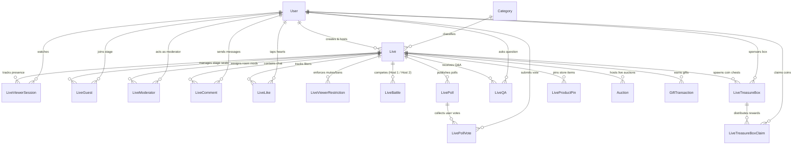

# Live Database Architecture & Schema Reference

> **Audience:** Backend Engineers, Mobile App Engineers (Flutter/React Native/iOS/Android), Frontend Web Engineers, and Database Administrators.  
> **Source of Truth:** [`prisma/schema.prisma`](../../prisma/schema.prisma)  
> **Engine:** PostgreSQL  
> **Related Docs:** [endpoints.md](./endpoints.md) · [logic.md](./logic.md) · [tasks.md](./tasks.md) · [mobile-api.md](./mobile-api.md) · [admin-api.md](./admin-api.md)

---

## Table of Contents

1. [Database Architecture & Overview](#1-database-architecture--overview)
2. [Complete Entity Relationship Diagram (ERD)](#2-complete-entity-relationship-diagram-erd)
3. [Live Streaming Core Tables](#3-live-streaming-core-tables)
   - [`Live`](#31-live)
   - [`LiveViewerSession`](#32-liveviewersession)
   - [`LiveLike`](#33-livelike)
   - [`LiveComment`](#34-livecomment)
4. [Multi-Guest Stage, Co-Hosting & Moderation Tables](#4-multi-guest-stage-co-hosting--moderation-tables)
   - [`LiveGuest`](#41-liveguest)
   - [`LiveModerator`](#42-livemoderator)
   - [`LiveViewerRestriction`](#43-liveviewerrestriction)
5. [Interactive Engagement & Monetization Tables](#5-interactive-engagement--monetization-tables)
   - [`LiveBattle`](#51-livebattle)
   - [`LivePoll`](#52-livepoll)
   - [`LivePollVote`](#53-livepollvote)
   - [`LiveQA`](#54-liveqa)
   - [`LiveTreasureBox`](#55-livetreasurebox)
   - [`LiveTreasureBoxClaim`](#56-livetreasureboxclaim)
   - [`LiveProductPin`](#57-liveproductpin)
6. [Cross-Module Relations & Core Integrations](#6-cross-module-relations--core-integrations)
   - [`User` (Host Leagues, Gifter Levels & Fan Clubs)](#61-user-model-integrations)
   - [`GiftTransaction` (Live Coin Credits & Combo Streaks)](#62-gifttransaction-model-integrations)
   - [`Auction` (Live Shopping & Showcase Bidding)](#63-auction-model-integrations)
   - [`Wallet` (Atomic Treasure Box Coin Credits & Deductions)](#64-wallet-model-integrations)
7. [Cascade Deletion, Concurrency & Teardown Invariants](#7-cascade-deletion-concurrency--teardown-invariants)

---

## 1. Database Architecture & Overview

The DCC Live system is backed by PostgreSQL through Prisma ORM. It implements a robust relational schema structured into 4 primary layers:

1. **Broadcasting & Discovery Core:** Handles stream creation, room tokens, lifecycle states (`PLANNED` → `LIVE` → `ENDED` / `BANNED`), concurrent viewer sessions, and heart tap analytics.
2. **Multi-Guest Stage Management:** Controls up to 8 live seats, co-host assignments, and host/mod stage track mutes.
3. **Audience Interactivity & Gamification:** Supports real-time PK battles, interactive polls with singular voting, audience Q&A, and countdown coin treasure drops.
4. **Commerce & Monetization:** Integrates live product pins, live auctions, and atomic coin distributions into user wallets.

---

## 2. Complete Entity Relationship Diagram (ERD)



---

## 3. Live Streaming Core Tables

### 3.1 `Live`
Primary entity representing a live broadcast session.

```prisma
model Live {
  id                        String    @id @default(uuid())
  userId                    String
  title                     String
  roomName                  String    @unique
  streamUrl                 String?
  coverUrl                  String?
  categoryId                String?
  status                    String    @default("PLANNED") // PLANNED | LIVE | ENDED | BANNED
  banReason                 String?
  viewers                   Int       @default(0)
  likeCount                 Int       @default(0)
  totalEarnedCoins          Float     @default(0)
  chatMode                  String    @default("EVERYONE") // EVERYONE | FOLLOWERS | SUBSCRIBERS
  slowModeSeconds           Int       @default(0)
  blockedKeywords           String[]  @default([])
  giftGoalTarget            Int?
  giftGoalTitle             String?
  giftGoalCurrent           Int       @default(0)
  guestsEnabled             Boolean   @default(true)
  guestRequestMode          String    @default("EVERYONE") // EVERYONE | FOLLOWERS | OFF
  maxGuests                 Int       @default(8)
  layout                    String    @default("GRID")     // GRID | PANEL
  allowGuestCamera          Boolean   @default(true)
  moderatorsCanManageGuests Boolean   @default(true)
  feedBoostUntil            DateTime?
  createdAt                 DateTime  @default(now())
  startedAt                 DateTime?
  endedAt                   DateTime?

  user             User                    @relation(fields: [userId], references: [id], onDelete: Cascade)
  category         Category?               @relation(fields: [categoryId], references: [id], onDelete: SetNull)
  moderators       LiveModerator[]
  comments         LiveComment[]
  likes            LiveLike[]
  guests           LiveGuest[]
  restrictions     LiveViewerRestriction[]
  giftTransactions GiftTransaction[]
  auctions         Auction[]
  battlesAsHost1   LiveBattle[]            @relation("BattleHost1")
  battlesAsHost2   LiveBattle[]            @relation("BattleHost2")
  viewerSessions   LiveViewerSession[]
  polls            LivePoll[]
  qaQuestions      LiveQA[]
  treasureBoxes    LiveTreasureBox[]
  productPins      LiveProductPin[]
  productOrders    ProductOrder[]

  updatedAt   DateTime @default(now()) @updatedAt
  createdById String?
  createdBy   User?    @relation("Live_createdBy", fields: [createdById], references: [id], onDelete: SetNull)
  updatedById String?
  updatedBy   User?    @relation("Live_updatedBy", fields: [updatedById], references: [id], onDelete: SetNull)

  @@index([userId])
  @@index([status])
  @@index([status, startedAt])
  @@index([categoryId])
  @@index([feedBoostUntil])
}
```

| Column | Type | Nullable | Default | Description |
|---|---|---|---|---|
| `id` | `UUID` | NO | `uuid()` | Primary Key |
| `userId` | `UUID` | NO | — | Host user ID (Foreign Key → `User.id` CASCADE) |
| `title` | `String` | NO | — | Stream title (1–120 characters) |
| `roomName` | `String` | NO | `live_{uuid}` | LiveKit room identifier (**Unique**) |
| `streamUrl` | `String` | YES | `null` | LiveKit WebSocket URL (e.g. `wss://live.example.com`) |
| `coverUrl` | `String` | YES | `null` | Cover image thumbnail URL |
| `categoryId` | `UUID` | YES | `null` | Category ID (Foreign Key → `Category.id` SET NULL) |
| `status` | `String` | NO | `'PLANNED'` | Status: `PLANNED`, `LIVE`, `ENDED`, `BANNED` |
| `banReason` | `String` | YES | `null` | Reason if stream was banned by moderator/admin |
| `viewers` | `Int` | NO | `0` | Real-time concurrent viewer counter |
| `likeCount` | `Int` | NO | `0` | Total heart taps received during broadcast |
| `totalEarnedCoins` | `Float` | NO | `0.0` | Total coins earned through gifts and auctions |
| `chatMode` | `String` | NO | `'EVERYONE'` | Chat mode: `EVERYONE`, `FOLLOWERS`, `SUBSCRIBERS` |
| `slowModeSeconds` | `Int` | NO | `0` | Cooldown between viewer comments (0 = disabled, max 60s) |
| `blockedKeywords` | `String[]` | NO | `[]` | Blacklisted keywords filtered from chat |
| `giftGoalTitle` | `String` | YES | `null` | Custom title for stream coin goal |
| `giftGoalTarget` | `Int` | YES | `null` | Target coins for stream goal |
| `giftGoalCurrent` | `Int` | NO | `0` | Current coins accumulated toward the goal |
| `guestsEnabled` | `Boolean` | NO | `true` | Whether stage guests are allowed |
| `guestRequestMode`| `String` | NO | `'EVERYONE'` | Request permissions: `EVERYONE`, `FOLLOWERS`, `OFF` |
| `maxGuests` | `Int` | NO | `8` | Maximum active guests on stage (1 to 8) |
| `layout` | `String` | NO | `'GRID'` | Layout presentation hint: `GRID`, `PANEL` |
| `allowGuestCamera`| `Boolean` | NO | `true` | Whether guest video publishing is allowed |
| `moderatorsCanManageGuests` | `Boolean` | NO | `true` | Whether mods can invite/kick/mute stage guests |
| `feedBoostUntil` | `DateTime` | YES | `null` | Admin promotion timestamp for For You feed |
| `startedAt` | `DateTime` | YES | `null` | Timestamp when stream transitioned to `LIVE` |
| `endedAt` | `DateTime` | YES | `null` | Timestamp when stream transitioned to `ENDED`/`BANNED` |

---

### 3.2 `LiveViewerSession`
Tracks viewer presence sessions to maintain active viewer counts.

```prisma
model LiveViewerSession {
  id       String    @id @default(uuid())
  liveId   String
  userId   String
  joinedAt DateTime  @default(now())
  leftAt   DateTime?

  live Live @relation(fields: [liveId], references: [id], onDelete: Cascade)
  user User @relation(fields: [userId], references: [id], onDelete: Cascade)

  createdAt   DateTime @default(now())
  updatedAt   DateTime @default(now()) @updatedAt
  createdById String?
  createdBy   User?    @relation("LiveViewerSession_createdBy", fields: [createdById], references: [id], onDelete: SetNull)
  updatedById String?
  updatedBy   User?    @relation("LiveViewerSession_updatedBy", fields: [updatedById], references: [id], onDelete: SetNull)

  @@unique([liveId, userId])
  @@index([liveId, leftAt])
  @@index([userId])
}
```

| Column | Type | Nullable | Default | Description |
|---|---|---|---|---|
| `id` | `UUID` | NO | `uuid()` | Primary Key |
| `liveId` | `UUID` | NO | — | Foreign Key → `Live.id` (CASCADE) |
| `userId` | `UUID` | NO | — | Foreign Key → `User.id` (CASCADE) |
| `joinedAt` | `DateTime` | NO | `now()` | Timestamp when viewer joined |
| `leftAt` | `DateTime` | YES | `null` | Timestamp when viewer left (`null` = currently active) |

---

### 3.3 `LiveLike`
Stores unique liker analytics per live stream.

```prisma
model LiveLike {
  id        String   @id @default(uuid())
  liveId    String
  userId    String
  createdAt DateTime @default(now())

  live Live @relation(fields: [liveId], references: [id], onDelete: Cascade)
  user User @relation(fields: [userId], references: [id], onDelete: Cascade)

  updatedAt   DateTime @default(now()) @updatedAt
  createdById String?
  createdBy   User?    @relation("LiveLike_createdBy", fields: [createdById], references: [id], onDelete: SetNull)
  updatedById String?
  updatedBy   User?    @relation("LiveLike_updatedBy", fields: [updatedById], references: [id], onDelete: SetNull)

  @@unique([liveId, userId])
  @@index([userId])
}
```

---

### 3.4 `LiveComment`
Stores live chat messages with support for pinning and soft-deletion.

```prisma
model LiveComment {
  id        String    @id @default(uuid())
  liveId    String
  userId    String
  content   String
  isPinned  Boolean   @default(false)
  pinnedAt  DateTime?
  isDeleted Boolean   @default(false)
  deletedAt DateTime?
  createdAt DateTime  @default(now())

  live Live @relation(fields: [liveId], references: [id], onDelete: Cascade)
  user User @relation(fields: [userId], references: [id], onDelete: Cascade)

  updatedAt   DateTime @default(now()) @updatedAt
  createdById String?
  createdBy   User?    @relation("LiveComment_createdBy", fields: [createdById], references: [id], onDelete: SetNull)
  updatedById String?
  updatedBy   User?    @relation("LiveComment_updatedBy", fields: [updatedById], references: [id], onDelete: SetNull)

  @@index([liveId])
  @@index([liveId, isPinned])
  @@index([createdAt])
}
```

---

## 4. Multi-Guest Stage, Co-Hosting & Moderation Tables

### 4.1 `LiveGuest`
Manages stage seats (up to 8 guests) and co-hosts.

```prisma
model LiveGuest {
  id              String    @id @default(uuid())
  liveId          String
  userId          String
  role            String    @default("GUEST")     // GUEST | CO_HOST
  status          String    @default("REQUESTED") // REQUESTED | INVITED | ACTIVE | LEFT | REJECTED | KICKED
  mutedByHost     Boolean   @default(false)
  cameraOffByHost Boolean   @default(false)
  invitedById     String?
  createdAt       DateTime  @default(now())
  joinedStageAt   DateTime?
  leftStageAt     DateTime?

  live Live @relation(fields: [liveId], references: [id], onDelete: Cascade)
  user User @relation(fields: [userId], references: [id], onDelete: Cascade)

  updatedAt   DateTime @default(now()) @updatedAt
  createdById String?
  createdBy   User?    @relation("LiveGuest_createdBy", fields: [createdById], references: [id], onDelete: SetNull)
  updatedById String?
  updatedBy   User?    @relation("LiveGuest_updatedBy", fields: [updatedById], references: [id], onDelete: SetNull)

  @@unique([liveId, userId])
  @@index([liveId, status])
  @@index([userId])
}
```

| Column | Type | Nullable | Default | Description |
|---|---|---|---|---|
| `id` | `UUID` | NO | `uuid()` | Primary Key |
| `liveId` | `UUID` | NO | — | Foreign Key → `Live.id` (CASCADE) |
| `userId` | `UUID` | NO | — | Foreign Key → `User.id` (CASCADE) |
| `role` | `String` | NO | `'GUEST'` | Role on stage: `GUEST`, `CO_HOST` |
| `status` | `String` | NO | `'REQUESTED'` | Status: `REQUESTED`, `INVITED`, `ACTIVE`, `LEFT`, `REJECTED`, `KICKED` |
| `mutedByHost` | `Boolean`| NO | `false` | Microphone forcefully muted by host/mod |
| `cameraOffByHost`| `Boolean`| NO | `false` | Camera video forcefully disabled by host/mod |
| `invitedById` | `UUID` | YES | `null` | Inviter user ID |
| `joinedStageAt` | `DateTime` | YES | `null` | Timestamp when guest joined stage |
| `leftStageAt` | `DateTime` | YES | `null` | Timestamp when guest left stage |

---

### 4.2 `LiveModerator`
Maintains room-level moderator assignments appointed by the stream host.

```prisma
model LiveModerator {
  liveId     String
  userId     String
  assignedAt DateTime @default(now())

  live Live @relation(fields: [liveId], references: [id], onDelete: Cascade)
  user User @relation(fields: [userId], references: [id], onDelete: Cascade)

  createdAt   DateTime @default(now())
  updatedAt   DateTime @default(now()) @updatedAt
  createdById String?
  createdBy   User?    @relation("LiveModerator_createdBy", fields: [createdById], references: [id], onDelete: SetNull)
  updatedById String?
  updatedBy   User?    @relation("LiveModerator_updatedBy", fields: [updatedById], references: [id], onDelete: SetNull)

  @@id([liveId, userId])
}
```

---

### 4.3 `LiveViewerRestriction`
Stores per-stream temporary viewer chat mutes and bans. Automatically cleaned upon stream teardown.

```prisma
model LiveViewerRestriction {
  liveId      String
  userId      String
  kind        String // MUTE_CHAT | BANNED
  createdById String
  reason      String?
  createdAt   DateTime @default(now())

  live Live @relation(fields: [liveId], references: [id], onDelete: Cascade)
  user User @relation(fields: [userId], references: [id], onDelete: Cascade)

  updatedAt   DateTime @default(now()) @updatedAt
  createdBy   User?    @relation("LiveViewerRestriction_createdBy", fields: [createdById], references: [id], onDelete: SetNull)
  updatedById String?
  updatedBy   User?    @relation("LiveViewerRestriction_updatedBy", fields: [updatedById], references: [id], onDelete: SetNull)

  @@id([liveId, userId])
  @@index([liveId, kind])
}
```

---

## 5. Interactive Engagement & Monetization Tables

### 5.1 `LiveBattle`
Stores real-time PK Battle competitions between two live streams.

```prisma
model LiveBattle {
  id               String    @id @default(uuid())
  live1Id          String
  live2Id          String
  startTime        DateTime  @default(now())
  endTime          DateTime
  live1Score       Int       @default(0)
  live2Score       Int       @default(0)
  winnerLiveId     String?
  status           String    @default("ACTIVE") // ACTIVE, FINISHED
  phase            String    @default("BATTLE") // WARMUP | BATTLE | VICTORY_LAP | FINISHED
  multiplier       Float     @default(1.0)
  multiplierEndsAt DateTime?
  host1TopGifters  Json?
  host2TopGifters  Json?

  live1 Live @relation("BattleHost1", fields: [live1Id], references: [id], onDelete: Cascade)
  live2 Live @relation("BattleHost2", fields: [live2Id], references: [id], onDelete: Cascade)

  createdAt   DateTime @default(now())
  updatedAt   DateTime @default(now()) @updatedAt
  createdById String?
  createdBy   User?    @relation("LiveBattle_createdBy", fields: [createdById], references: [id], onDelete: SetNull)
  updatedById String?
  updatedBy   User?    @relation("LiveBattle_updatedBy", fields: [updatedById], references: [id], onDelete: SetNull)

  @@index([live1Id])
  @@index([live2Id])
}
```

| Column | Type | Nullable | Default | Description |
|---|---|---|---|---|
| `id` | `UUID` | NO | `uuid()` | Primary Key |
| `live1Id` | `UUID` | NO | — | First stream ID (Foreign Key → `Live.id` CASCADE) |
| `live2Id` | `UUID` | NO | — | Opponent stream ID (Foreign Key → `Live.id` CASCADE) |
| `startTime` | `DateTime` | NO | `now()` | Battle start timestamp |
| `endTime` | `DateTime` | NO | — | Battle scheduled end timestamp |
| `live1Score` | `Int` | NO | `0` | Points accumulated by Live 1 from gifts |
| `live2Score` | `Int` | NO | `0` | Points accumulated by Live 2 from gifts |
| `winnerLiveId` | `UUID` | YES | `null` | Winner stream ID (`null` on tie or while active) |
| `status` | `String` | NO | `'ACTIVE'` | Status: `ACTIVE`, `FINISHED` |
| `phase` | `String` | NO | `'BATTLE'` | Phase: `WARMUP`, `BATTLE`, `VICTORY_LAP`, `FINISHED` |
| `multiplier` | `Float` | NO | `1.0` | Active point speed multiplier (1.5 to 5.0) |
| `multiplierEndsAt` | `DateTime` | YES | `null` | Expiration timestamp for speed multiplier |

---

### 5.2 `LivePoll` & `LivePollVote`
Manages live audience polls and votes.

```prisma
model LivePoll {
  id        String    @id @default(uuid())
  liveId    String
  question  String
  options   Json
  status    String    @default("ACTIVE") // ACTIVE | ENDED
  createdAt DateTime  @default(now())
  endedAt   DateTime?

  live  Live           @relation(fields: [liveId], references: [id], onDelete: Cascade)
  votes LivePollVote[]

  updatedAt   DateTime @default(now()) @updatedAt
  createdById String?
  createdBy   User?    @relation("LivePoll_createdBy", fields: [createdById], references: [id], onDelete: SetNull)
  updatedById String?
  updatedBy   User?    @relation("LivePoll_updatedBy", fields: [updatedById], references: [id], onDelete: SetNull)

  @@index([liveId, status])
}

model LivePollVote {
  id          String   @id @default(uuid())
  pollId      String
  userId      String
  optionIndex Int
  createdAt   DateTime @default(now())

  poll LivePoll @relation(fields: [pollId], references: [id], onDelete: Cascade)
  user User     @relation("LivePollVote_user", fields: [userId], references: [id], onDelete: Cascade)

  @@unique([pollId, userId])
  @@index([pollId])
}
```

---

### 5.3 `LiveQA`
Stores audience Q&A questions with host pinning and answered tracking.

```prisma
model LiveQA {
  id         String   @id @default(uuid())
  liveId     String
  userId     String
  question   String
  isAnswered Boolean  @default(false)
  isPinned   Boolean  @default(false)
  createdAt  DateTime @default(now())

  live Live @relation(fields: [liveId], references: [id], onDelete: Cascade)
  user User @relation("LiveQA_user", fields: [userId], references: [id], onDelete: Cascade)

  updatedAt   DateTime @default(now()) @updatedAt
  createdById String?
  createdBy   User?    @relation("LiveQA_createdBy", fields: [createdById], references: [id], onDelete: SetNull)
  updatedById String?
  updatedBy   User?    @relation("LiveQA_updatedBy", fields: [updatedById], references: [id], onDelete: SetNull)

  @@index([liveId])
  @@index([liveId, isPinned])
}
```

---

### 5.4 `LiveTreasureBox` & `LiveTreasureBoxClaim`
Manages countdown coin chests dropped by sponsors and randomized wallet claims.

```prisma
model LiveTreasureBox {
  id             String                 @id @default(uuid())
  liveId         String
  creatorId      String
  totalCoins     Float
  remainingCoins Float
  maxClaims      Int
  claimedCount   Int                    @default(0)
  unlocksAt      DateTime
  status         String                 @default("WAITING") // WAITING | OPEN | EXPIRED
  claims         LiveTreasureBoxClaim[]

  live    Live @relation(fields: [liveId], references: [id], onDelete: Cascade)
  creator User @relation("LiveTreasureBox_creator", fields: [creatorId], references: [id], onDelete: Cascade)

  createdAt   DateTime @default(now())
  updatedAt   DateTime @default(now()) @updatedAt
  createdById String?
  createdBy   User?    @relation("LiveTreasureBox_createdBy", fields: [createdById], references: [id], onDelete: SetNull)
  updatedById String?
  updatedBy   User?    @relation("LiveTreasureBox_updatedBy", fields: [updatedById], references: [id], onDelete: SetNull)

  @@index([liveId, status])
}

model LiveTreasureBoxClaim {
  id        String   @id @default(uuid())
  boxId     String
  userId    String
  coinsWon  Float
  createdAt DateTime @default(now())

  box  LiveTreasureBox @relation(fields: [boxId], references: [id], onDelete: Cascade)
  user User            @relation("LiveTreasureBoxClaim_user", fields: [userId], references: [id], onDelete: Cascade)

  @@unique([boxId, userId])
  @@index([boxId])
}
```

---

### 5.5 `LiveProductPin`
Manages stream shop products with showcase ordering.

```prisma
model LiveProductPin {
  id        String    @id @default(uuid())
  liveId    String
  productId String
  pinOrder  Int       @default(0)
  isPinned  Boolean   @default(false)
  pinnedAt  DateTime?
  createdAt DateTime  @default(now())
  updatedAt DateTime  @default(now()) @updatedAt

  live    Live    @relation(fields: [liveId], references: [id], onDelete: Cascade)
  product Product @relation(fields: [productId], references: [id], onDelete: Cascade)

  createdById String?
  createdBy   User?   @relation("LiveProductPin_createdBy", fields: [createdById], references: [id], onDelete: SetNull)
  updatedById String?
  updatedBy   User?   @relation("LiveProductPin_updatedBy", fields: [updatedById], references: [id], onDelete: SetNull)

  @@unique([liveId, productId])
  @@index([liveId, isPinned, pinOrder])
}
```

---

## 6. Cross-Module Relations & Core Integrations

### 6.1 `User` Model Integrations
The core `User` model includes several fields that support live stream gamification:
- `hostLeagueTier` (`String?`): Creator's host league rank (e.g. `'B2'`, `'S'`), calculated from total live earned coins and follower count.
- `totalLiveEarnedCoins` (`Float`): Lifetime accumulated coins earned across all live broadcasts.
- `totalLikes` (`Int`): Profile heart counter (TikTok-style heart count).
- `fanClubEnabled` (`Boolean`), `fanClubName` (`String?`): Host-managed subscriber fan club.
- `gifterLevel` (`Int`): Viewer level badge (`Lv. 1` to `Lv. 50+`), calculated from `totalSpentCoins`.

### 6.2 `GiftTransaction` Model Integrations
- `liveId` (`String?`): Bound to active live stream when gifted.
- `contributionCoins` (`Float`): Contributed coins that increment `Live.totalEarnedCoins` and feed PK Battle scores.
- `combo` (`Int`): Real-time rapid tap streak count.

### 6.3 `Auction` Model Integrations
- `liveId` (`String?`): Associates auction with a live stream.
- `pinOrder` (`Int`), `isPinned` (`Boolean`): Positions auction prominently in the live shopping gallery.

### 6.4 `Wallet` Model Integrations
- When a user drops a Treasure Box (`POST /lives/:id/treasure-boxes`), coins are atomically deducted from `Wallet.balanceCoins`.
- When a viewer claims a share (`POST /lives/:id/treasure-boxes/:boxId/claim`), coins won are atomically credited to the viewer's `Wallet.balanceCoins`.

---

## 7. Cascade Deletion, Concurrency & Teardown Invariants

1. **Foreign Key Cascade Deletion:**
   Deleting a `Live` record automatically cascades across PostgreSQL foreign keys to cleanly remove all child sessions, guests, comments, likes, restrictions, battles, polls, votes, Q&As, treasure boxes, claims, and product pins.

2. **Atomic Lifecycle Teardown:**
   When a stream ends (`POST /lives/:id/end`, `POST /lives/admin/:id/end`, `POST /lives/admin/:id/ban`, or LiveKit webhook `participant_left` / `room_finished`):
   - All active battles are marked `FINISHED`.
   - All open viewer sessions are closed (`leftAt = now()`).
   - Active stage guests are set to `LEFT`.
   - All temporary `LiveViewerRestriction` entries are cleared.
   - The LiveKit SFU room is deleted server-side to prevent stale JWT publishing.

3. **Concurrency & Race Condition Protection:**
   - Treasure box claims and coin balances use atomic Prisma transactions (`prisma.$transaction`).
   - Like tapping uses in-memory sliding window rate limits (15 attempts/sec/user/live) while atomically bumping `Live.likeCount`.
   - Poll votes enforce single-vote integrity via the database constraint `@@unique([pollId, userId])`.
