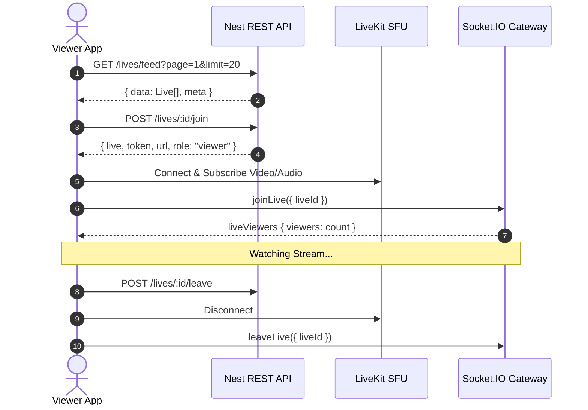
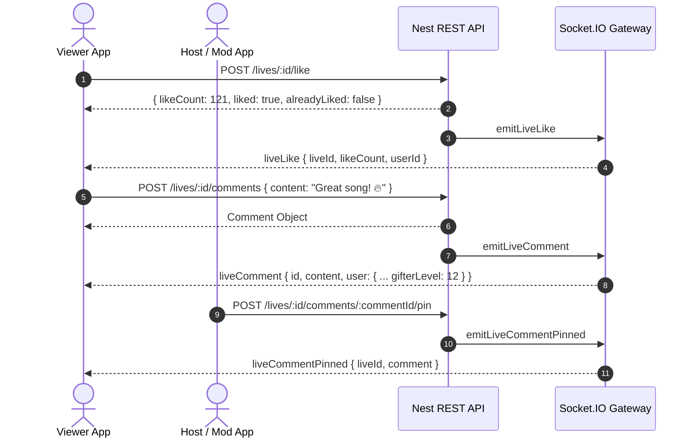
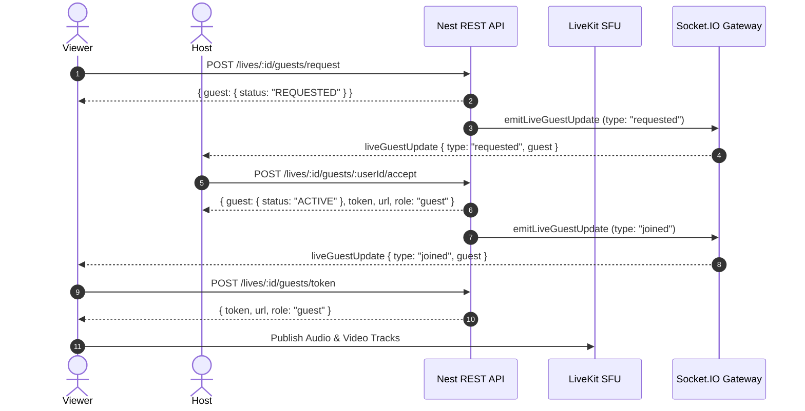
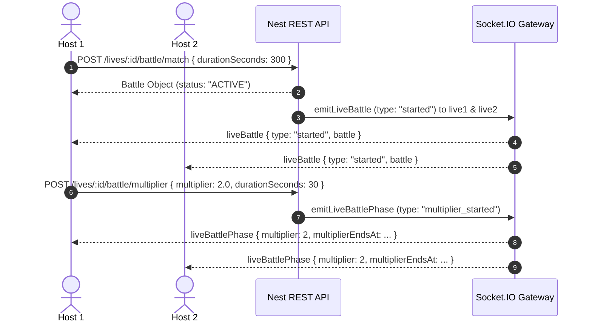
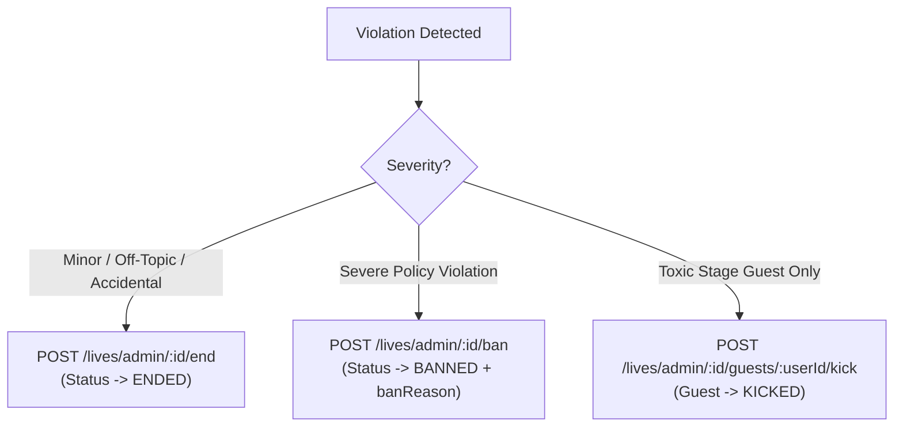

```mermaid
sequenceDiagram
    autonumber
    actor Host as Host App
    participant API as Nest REST API
    participant LK as LiveKit SFU
    participant WS as Socket.IO Gateway

    Host->>API: POST /lives (startNow: true)
    API-->>Host: { live, token, url, role: "host" }
    Host->>LK: Connect & Publish Camera/Mic (host token)
    Host->>WS: joinLive({ liveId })
    Host->>WS: joinUser({ userId })
    Note over Host,WS: Broadcasting Live...
    Host->>API: POST /lives/:id/end
    API-->>Host: { live (status: "ENDED") }
    Host->>LK: Disconnect Room
    Host->>WS: leaveLive({ liveId })
```

# Lives — Implementation Tasks & Function Guide

> **Audience:** Mobile App Engineers (Flutter/React Native/iOS/Android) & Admin Dashboard Frontend Engineers.  
> **Purpose:** Step-by-step task breakdown with every endpoint, payload, function signature, WebSocket event, and UI implementation recipe.  
> **Related:** [mobile-api.md](./mobile-api.md) · [admin-api.md](./admin-api.md) · [logic.md](./logic.md) · [production.md](./production.md)

---

## Table of Contents

- [Overview & Architecture Map](#overview--architecture-map)
- [PART 1: Mobile App Implementation Tasks (Task 1 to Task 12)](#part-1-mobile-app-implementation-tasks)
  - [Task M1: Go-Live & Host Streaming Lifecycle](#task-m1-go-live--host-streaming-lifecycle)
  - [Task M2: Stream Discovery, Feed & Watch Experience](#task-m2-stream-discovery-feed--watch-experience)
  - [Task M3: Realtime Chat, Heart Taps & Rapid Likes](#task-m3-realtime-chat-heart-taps--rapid-likes)
  - [Task M4: Multi-Guest Stage & Co-Hosting](#task-m4-multi-guest-stage--co-hosting)
  - [Task M5: PK Battles, Auto-Match & Speed Multipliers](#task-m5-pk-battles-auto-match--speed-multipliers)
  - [Task M6: Interactive Gift Goals](#task-m6-interactive-gift-goals)
  - [Task M7: Interactive Polls](#task-m7-interactive-polls)
  - [Task M8: Live Q&A Box](#task-m8-live-qa-box)
  - [Task M9: Treasure Boxes / Coin Drops](#task-m9-treasure-boxes--coin-drops)
  - [Task M10: Live Shopping / Auction Gallery](#task-m10-live-shopping--auction-gallery)
  - [Task M11: Hourly Ranking, Host Leagues & Fan Clubs](#task-m11-hourly-ranking-host-leagues--fan-clubs)
  - [Task M12: Post-Live Analytics Summary](#task-m12-post-live-analytics-summary)
- [PART 2: Admin Dashboard Implementation Tasks (Task D1 to Task D4)](#part-2-admin-dashboard-implementation-tasks)
  - [Task D1: Live Streams Management Queue & Filters](#task-d1-live-streams-management-queue--filters)
  - [Task D2: Realtime Live Ops Wall & Inspection](#task-d2-realtime-live-ops-wall--inspection)
  - [Task D3: Moderate Stream (Soft-End, Ban, Force-Kick Guest)](#task-d3-moderate-stream-soft-end-ban-force-kick-guest)
  - [Task D4: Stream Promotion / Feed Boost](#task-d4-stream-promotion--feed-boost)
- [Summary Function Matrix](#summary-function-matrix)

---

## Overview & Architecture Map

Every Live feature coordinates across three interconnected layers:
1. **Nest REST API (`/lives`, `/gifts`, …)**: Source of truth for lifecycle, authorization, money transactions, database storage, and moderation.
2. **LiveKit WebRTC SFU**: Video and audio capture/publishing for hosts/guests and low-latency subscription for viewers.
3. **Socket.IO Realtime Gateway (`live_{id}`)**: Instant interactive HUD updates (comments, gift animations, combos, PK scores, poll voting, Q&A, coin drops, viewer counts, and moderation actions).

---

# PART 1: Mobile App Implementation Tasks

---

### Task M1: Go-Live & Host Streaming Lifecycle

#### 🎯 Goal
Allow a creator to set up, start, manage, and end a broadcast with video/audio publishing and real-time followers notification.

#### 🛠 Step-by-Step Implementation Flow



#### 📦 API & Socket Functions

| Action | Method & Endpoint | Payload / Query | Response / Event |
|---|---|---|---|
| Create & Start Live | `POST /lives` | `{ title: string, coverUrl?: string, categoryId?: string, startNow: true }` | `{ live: Live, token: string, url: string, role: "host" }` |
| Update Stream Info | `PATCH /lives/:id` | `{ title?: string, coverUrl?: string, categoryId?: string \| null }` | `Live` |
| End Stream | `POST /lives/:id/end` | none | `Live` (emits `liveEnded` to room) |
| Listen Live Ended | Socket on `liveEnded` | `{ liveId: string, status: "ENDED" \| "BANNED", reason?: string }` | UI tear-down & transition to summary screen |

#### 📱 Mobile UI / UX Checklist
- [ ] Camera preview screen with title input, cover picker, and category selector.
- [ ] "Go LIVE" button initiating `POST /lives` with `startNow: true`.
- [ ] Connect LiveKit client in **publisher** mode (enable audio & video tracks).
- [ ] Connect Socket.IO and emit `joinLive({ liveId })`.
- [ ] "End Broadcast" confirmation modal calling `POST /lives/:id/end`.
- [ ] On broadcast end, navigate host to Task M12 (Post-Live Summary Screen).

---

### Task M2: Stream Discovery, Feed & Watch Experience

#### 🎯 Goal
Provide vertical scrolling TikTok-style feed for live streams, room joining, video playback subscription, and viewer presence management.

#### 🛠 Step-by-Step Implementation Flow



#### 📦 API & Socket Functions

| Action | Method & Endpoint | Payload / Query | Response / Event |
|---|---|---|---|
| Fetch Live Feed | `GET /lives/feed` | `?page=1&limit=20&categoryId=uuid&followingOnly=boolean` | `{ data: Live[], meta: PaginationMeta }` |
| Fetch Single Live | `GET /lives/:id` | none | `Live` (with `activeAuctions`, `pinnedComment`, `isPopular`) |
| Join Stream | `POST /lives/:id/join` | none | `{ live: Live, token: string, url: string, role: "viewer", guest: Guest \| null }` |
| Leave Stream | `POST /lives/:id/leave` | none | `{ success: true, viewers: number }` |
| Viewer Count Update | Socket on `liveViewers` | `{ liveId: string, viewers: number }` | Update top viewer count pill in HUD |

#### 📱 Mobile UI / UX Checklist
- [ ] Vertical paging swipe feed for active streams.
- [ ] On focus, call `POST /lives/:id/join`, connect LiveKit as **subscriber**, and emit `joinLive`.
- [ ] On swipe away/exit, call `POST /lives/:id/leave`, disconnect LiveKit track subscriptions, and emit `leaveLive`.
- [ ] Display host badge, follower button, popular badge (e.g. "🔥 Popular"), and live viewer count.

---

### Task M3: Realtime Chat, Heart Taps & Rapid Likes

#### 🎯 Goal
Engage stream viewers with flying heart tap animations, live comments with gifter level badges, comment pinning, and moderation controls.

#### 🛠 Step-by-Step Implementation Flow



#### 📦 API & Socket Functions

| Action | Method & Endpoint | Payload / Query | Response / Event |
|---|---|---|---|
| Tap Like (Heart) | `POST /lives/:id/like` | none | `{ likeCount: number, liked: true, alreadyLiked: boolean }` |
| Like WebSocket Event | Socket on `liveLike` | `{ liveId: string, likeCount: number, userId: string }` | Animate floating heart bubble on screen |
| Send Chat Comment | `POST /lives/:id/comments` | `{ content: string }` (1–500 chars) | `LiveComment` object |
| Comment Received | Socket on `liveComment` | `{ id: string, content: string, user: HostCardUser, createdAt: string }` | Append message to chat scroll list |
| Pin Comment | `POST /lives/:id/comments/:commentId/pin` | none | `{ success: true, commentId: string }` |
| Unpin Comment | `POST /lives/:id/comments/:commentId/unpin` | none | `{ success: true, commentId: string }` |
| Pinned Socket Event | Socket on `liveCommentPinned` | `{ liveId: string, comment: LiveComment }` | Render floating pinned comment bar |
| Unpinned Socket Event | Socket on `liveCommentUnpinned` | `{ liveId: string, commentId: string }` | Remove floating pinned comment bar |
| Delete Comment | `DELETE /lives/:id/comments/:commentId` | none | `{ success: true, commentId: string }` |
| Deleted Socket Event | Socket on `liveCommentDeleted` | `{ liveId: string, commentId: string, deletedBy: string }` | Remove bubble from chat stream |
| Mute Viewer Chat | `POST /lives/:id/viewers/:userId/mute-chat` | `{ reason?: string }` | `Live` |
| Unmute Viewer Chat | `POST /lives/:id/viewers/:userId/unmute-chat` | none | `Live` |
| Ban Viewer from Live | `POST /lives/:id/viewers/:userId/ban` | `{ reason?: string }` | `Live` |
| Moderation Socket Event | Socket on `liveModeration` | `{ type: "chat_muted" \| "chat_unmuted" \| "viewer_banned" \| "viewer_unbanned", liveId, userId }` | Show warning banner / kick banned viewer |

#### 📱 Mobile UI / UX Checklist
- [ ] Heart tap gesture recognizer on right side of video with burst heart animation.
- [ ] Auto-scrolling chat overlay with username, verified badge, and colored Gifter Level badge (`[Lv. X]`).
- [ ] Long-press on comment (for host/moderator) to show action sheet: **Pin**, **Delete**, **Mute Chat**, **Ban from Stream**.

---

### Task M4: Multi-Guest Stage & Co-Hosting

#### 🎯 Goal
Allow up to 8 guests on stage with grid/panel video layouts, host/mod invitations, request approvals, and granular camera/mic controls.

#### 🛠 Step-by-Step Implementation Flow



#### 📦 API & Socket Functions

| Action | Method & Endpoint | Payload / Query | Response / Event |
|---|---|---|---|
| Update Stage Settings | `PATCH /lives/:id/settings` | `{ guestsEnabled?: bool, guestRequestMode?: "EVERYONE"\|"FOLLOWERS"\|"OFF", maxGuests?: number, layout?: "GRID"\|"PANEL", allowGuestCamera?: bool, moderatorsCanManageGuests?: bool }` | Settings Object |
| List Current Guests | `GET /lives/:id/guests` | none | `{ data: LiveGuest[] }` |
| Request Stage Seat | `POST /lives/:id/guests/request` | none | `{ guest: LiveGuest, token?: string, url?: string, role?: string }` |
| Host Invite Guest | `POST /lives/:id/guests/invite` | `{ userId: string, role?: "GUEST" \| "CO_HOST" }` | `{ guest: LiveGuest }` (emits `liveGuestInvite` on `user_{id}`) |
| Accept Host Invite | `POST /lives/:id/guests/accept-invite` | none | `{ guest: LiveGuest, token: string, url: string, role: "guest" }` |
| Accept Viewer Request | `POST /lives/:id/guests/:userId/accept` | none | `{ guest: LiveGuest, token: string, url: string, role: "guest" }` |
| Reject Seat Request | `POST /lives/:id/guests/:userId/reject` | none | `{ guest: LiveGuest }` |
| Leave Stage Seat | `POST /lives/:id/guests/leave` | none | `{ guest: LiveGuest }` |
| Kick Guest from Stage | `POST /lives/:id/guests/:userId/kick` | none | `{ guest: LiveGuest }` |
| Mute Guest Mic | `POST /lives/:id/guests/:userId/mute` | none | `{ guest: LiveGuest }` |
| Unmute Guest Mic | `POST /lives/:id/guests/:userId/unmute` | none | `{ guest: LiveGuest }` |
| Turn Guest Camera Off | `POST /lives/:id/guests/:userId/camera-off` | none | `{ guest: LiveGuest }` |
| Allow Guest Camera On | `POST /lives/:id/guests/:userId/camera-on` | none | `{ guest: LiveGuest }` |
| Promote to Co-Host | `POST /lives/:id/guests/:userId/promote` | none | `{ guest: LiveGuest }` |
| Demote to Guest | `POST /lives/:id/guests/:userId/demote` | none | `{ guest: LiveGuest }` |
| Refresh Guest Token | `POST /lives/:id/guests/token` | none | `{ token: string, url: string, role: "guest", guest: LiveGuest }` |
| Guest Stage Socket Updates | Socket on `liveGuestUpdate` | `{ type: "requested" \| "invited" \| "joined" \| "left" \| "rejected" \| "kicked" \| "muted" \| "unmuted" \| "camera_off" \| "camera_on" \| "role" \| "settings", guest, settings }` | Dynamically re-render stage video grid / update mic/cam status |

---

### Task M5: PK Battles, Auto-Match & Speed Multipliers

#### 🎯 Goal
Conduct real-time competitive battles between two stream hosts with gift point counters, auto-matching, 2x/3x speed boost challenges, and victory lap screens.

#### 🛠 Step-by-Step Implementation Flow



#### 📦 API & Socket Functions

| Action | Method & Endpoint | Payload / Query | Response / Event |
|---|---|---|---|
| List Potential Opponents | `GET /lives/:id/battle/opponents` | `?limit=20` | `{ data: Array<{ id, title, viewers, user, category }> }` |
| 1-Tap Auto Match | `POST /lives/:id/battle/match` | `{ durationSeconds?: number }` (30–1800s, default 300) | `LiveBattle` object |
| Start Manual Battle | `POST /lives/:id/battle` | `{ opponentLiveId: string, durationSeconds?: number }` | `LiveBattle` object |
| Get Active Battle Status | `GET /lives/:id/battle` | none | `{ battle: LiveBattle \| null }` |
| Trigger Speed Multiplier | `POST /lives/:id/battle/multiplier` | `{ multiplier: number, durationSeconds: number }` (e.g. 2.0x for 30s) | `LiveBattle` object |
| Manually End Battle | `POST /lives/:id/battle/:battleId/end` | none | `LiveBattle` (status: `FINISHED`, `phase: "VICTORY_LAP"`) |
| Battle State Socket Event | Socket on `liveBattle` | `{ type: "started" \| "score" \| "finished", battle: LiveBattle }` | Update split screen PK point bar / play victory/defeat animation |
| Battle Phase Socket Event | Socket on `liveBattlePhase` | `{ type: "multiplier_started", multiplier: number, multiplierEndsAt: string, battle }` | Display "SPEED BOOST x2" timer animation |

---

### Task M6: Interactive Gift Goals

#### 🎯 Goal
Motivate audience gifting with custom stream progress bars and live coin accumulation HUDs.

#### 📦 API & Socket Functions

| Action | Method & Endpoint | Payload / Query | Response / Event |
|---|---|---|---|
| Set Gift Goal | `POST /lives/:id/gift-goal` | `{ title?: string, target: number }` | `{ id, giftGoalTitle, giftGoalTarget, giftGoalCurrent }` |
| Gift Goal Socket Event | Socket on `liveGiftGoalUpdate` | `{ id: string, giftGoalTitle: string, giftGoalTarget: number, giftGoalCurrent: number }` | Update live goal progress bar percentage |

#### 📱 Mobile UI / UX Checklist
- [ ] Host setting modal: enter goal title and target coins.
- [ ] Compact floating progress bar on viewer HUD: `${current} / ${target} Coins (${percentage}%)`.
- [ ] Confetti celebration animation when `giftGoalCurrent >= giftGoalTarget`.

---

### Task M7: Interactive Polls

#### 🎯 Goal
Engage live viewers with real-time in-stream polls, instant voting, and animated percentage distributions.

#### 📦 API & Socket Functions

| Action | Method & Endpoint | Payload / Query | Response / Event |
|---|---|---|---|
| Create Live Poll | `POST /lives/:id/polls` | `{ question: string, options: string[] }` (2 to 5 options) | Formatted Poll Object |
| Vote in Poll | `POST /lives/:id/polls/:pollId/vote` | `{ optionIndex: number }` | Formatted Poll Object |
| End Live Poll | `POST /lives/:id/polls/:pollId/end` | none | Formatted Poll Object (status: `ENDED`) |
| Get Active Poll | `GET /lives/:id/polls/active` | none | Formatted Poll Object or `null` |
| Poll Socket Event | Socket on `livePollUpdated` | `{ id, liveId, question, options: [{ text, votes, percentage }], totalVotes, status }` | Animate vote bars and highlight winning option |

---

### Task M8: Live Q&A Box

#### 🎯 Goal
Allow viewers to submit questions and enable the host to pin questions to the screen and mark them as answered.

#### 📦 API & Socket Functions

| Action | Method & Endpoint | Payload / Query | Response / Event |
|---|---|---|---|
| Submit Question | `POST /lives/:id/qa` | `{ question: string }` | `LiveQA` object |
| List Stream Questions | `GET /lives/:id/qa` | none | `LiveQA[]` (pinned questions first) |
| Pin Question on Screen | `POST /lives/:id/qa/:qaId/pin` | none | Updated `LiveQA` (isPinned: true) |
| Mark Answered | `POST /lives/:id/qa/:qaId/answer` | none | Updated `LiveQA` (isAnswered: true) |
| Q&A Socket Event | Socket on `liveQAUpdated` | `{ type: "created" \| "pinned" \| "answered", qa: LiveQA }` | Show pinned question banner on video stream |

---

### Task M9: Treasure Boxes / Coin Drops

#### 🎯 Goal
Enable coin rain drops from hosts or generous viewers with countdown timers and randomized wallet coin claims.

#### 📦 API & Socket Functions

| Action | Method & Endpoint | Payload / Query | Response / Event |
|---|---|---|---|
| Drop Treasure Box | `POST /lives/:id/treasure-boxes` | `{ totalCoins: number, maxClaims: number, delaySeconds?: number }` | `LiveTreasureBox` (status: `WAITING`) |
| Claim Box Coins | `POST /lives/:id/treasure-boxes/:boxId/claim` | none | `{ id, boxId, userId, coinsWon: number, box: LiveTreasureBox }` |
| List Active Boxes | `GET /lives/:id/treasure-boxes` | none | `LiveTreasureBox[]` |
| Box Spawned Event | Socket on `liveTreasureBoxSpawned` | `LiveTreasureBox` | Render floating treasure chest with countdown timer |
| Box Claimed Event | Socket on `liveTreasureBoxClaimed` | `{ boxId, userId, coinsWon, claimedCount, maxClaims }` | Trigger coin splash animation and toast banner |

---

### Task M10: Live Shopping / Auction Gallery

#### 🎯 Goal
Showcase live auction items, pinned showcase products, reordering, and instant gift bidding directly inside the stream.

#### 📦 API & Socket Functions

| Action | Method & Endpoint | Payload / Query | Response / Event |
|---|---|---|---|
| Create Live Auction | `POST /lives/:id/auctions` | `{ itemName, targetPrice, itemImageUrl?, startingPrice?, startedAt?, endedAt? }` | `Auction` object |
| Get Gallery Items | `GET /lives/:id/gallery` | none | Active shop items (pinned first, then `pinOrder`) |
| List Live Auctions | `GET /lives/:id/auctions` | `?status=ACTIVE\|COMPLETED\|CANCELLED\|ALL` | `{ data: Auction[], meta }` |
| Pin Auction to Showcase | `PATCH /lives/:id/auctions/:auctionId/pin` | `{ pinned: true }` | Updated `Auction` |
| Reorder Gallery Items | `PATCH /lives/:id/auctions/reorder` | `{ auctionIds: string[] }` | Gallery list |
| Live Auction Socket Event | Socket on `liveAuction` | `{ liveId: string, auction: Auction, action: "created" \| "pinned" \| "unpinned" \| "reordered" \| "cancelled" }` | Update shopping bag badge & showcase popup |

---

### Task M11: Hourly Ranking, Host Leagues & Fan Clubs

#### 🎯 Goal
Display creator competitive rankings (ترتيب كل ساعة), host league tier badges (e.g. B2), and subscriber-exclusive fan club perks.

#### 📦 API & Socket Functions

| Action | Method & Endpoint | Payload / Query | Response / Event |
|---|---|---|---|
| Global Hourly Leaderboard | `GET /lives/leaderboard/hourly` | `?limit=20` | `{ windowStartsAt, windowEndsAt, data: Array<{ rank, score, hourlyCoins, isPopular, live }> }` |
| Stream Hourly Rank | `GET /lives/:id/leaderboard/hourly` | none | `{ liveId, rank, score, hourlyCoins, isPopular, popularReason }` |
| Top Gifters for Live | `GET /lives/:id/leaderboard/gifters` | `?limit=10&window=session\|hour` | `{ liveId, window, data: Array<{ rank, totalCoins, user }> }` |
| Host League Tier Info | `GET /lives/host-league/:userId` | none | `{ userId, username, hostLeagueTier, totalLiveEarnedCoins, nextTier, progressPercentage }` |
| League Definitions Table | `GET /lives/leagues` | none | `{ tiers: Array<{ tier, minCoins, minFollowers }> }` |
| Join Creator Fan Club | `POST /creators/:creatorId/fan-club/subscribe` | none | Subscription Object |
| Leave Fan Club | `DELETE /creators/:creatorId/fan-club/subscribe` | none | `{ success: true }` |
| Rank Socket Update | Socket on `liveHourlyRankUpdated` | `{ liveId, rank, score, hourlyCoins, isPopular, popularReason }` | Update top ranking badge in live header |
| Top Gifters Socket Update | Socket on `liveTopGiftersUpdated` | `{ liveId, window, data: TopGifter[] }` | Update top 3 gifter avatars in stream header |
| Host League Socket Update | Socket on `hostLeagueUpdated` | `{ userId, liveId, league, previousLeague, nextTier, progressPercentage }` | Level up badge animation |

---

### Task M12: Post-Live Analytics Summary

#### 🎯 Goal
Present the host with a post-stream recap report detailing performance metrics immediately after ending the stream.

#### 📦 API & Socket Functions

| Action | Method & Endpoint | Payload / Query | Response / Event |
|---|---|---|---|
| Get Post-Live Summary | `GET /lives/:id/summary` | none (Host Auth required) | Post-Live Summary Report |

#### 📊 Post-Live Summary Response Schema
```json
{
  "liveId": "d9b23f81-5d92-4f32-8412-4299b922a101",
  "title": "Acoustic Night & Song Requests",
  "coverUrl": "https://cdn.example.com/covers/acoustic.jpg",
  "startedAt": "2026-08-15T10:00:00.000Z",
  "endedAt": "2026-08-15T11:45:00.000Z",
  "durationSeconds": 6300,
  "peakViewers": 540,
  "totalViewerSessions": 2840,
  "totalLikes": 38200,
  "totalComments": 1420,
  "totalEarnedCoins": 85000,
  "topGifters": [
    {
      "user": {
        "id": "u-1",
        "username": "alex_music",
        "fullName": "Alex Smith",
        "avatarUrl": "https://…",
        "isVerified": true,
        "gifterLevel": 32
      },
      "totalCoins": 42000
    }
  ]
}
```

---

# PART 2: Admin Dashboard Implementation Tasks

---

### Task D1: Live Streams Management Queue & Filters

#### 🎯 Goal
Allow administrators and operations staff to view all streams across statuses, filter by live/banned/planned, search by creator username or title, and view stream health metrics.

#### 📦 API & RBAC Configuration

- **Required Permission:** `lives.admin.read`
- **Method & Endpoint:** `GET /lives/admin/all`
- **Query Parameters:**
  - `page` (integer, default 1)
  - `limit` (integer, default 20, max 100)
  - `status` (`PLANNED` | `LIVE` | `ENDED` | `BANNED`)
  - `userId` (filter by host UUID)
  - `search` (case-insensitive search in title & host username)

#### 🖥 Dashboard Implementation Checklist
- [ ] Table Columns: Status Badge, Title, Host Info (Avatar + Username + Verified), Category, Viewers, Likes, Coins Earned, Started At, Actions.
- [ ] Status Filters: All, Live Now (`LIVE`), Planned (`PLANNED`), Ended (`ENDED`), Banned (`BANNED`).
- [ ] Search input triggering debounced queries with `search=...`.

---

### Task D2: Realtime Live Ops Wall & Inspection

#### 🎯 Goal
Provide ops teams with a live monitor wall to inspect stream chat, guest lists, active battles, polls, and coin transactions in real time.

#### 📦 API & Socket Functions

| Action | Method & Endpoint / Socket | Purpose |
|---|---|---|
| Fetch Detailed State | `GET /lives/:id` | Full live state + `activeAuctions` + `pinnedComment` |
| Inspect Stage Guests | `GET /lives/:id/guests` | List all `REQUESTED`, `INVITED`, and `ACTIVE` guests |
| Inspect Chat History | `GET /lives/:id/comments` | List recent comments |
| Inspect Active Battles | `GET /lives/:id/battle` | View PK scores and competitors |
| Realtime Ops Socket Monitor | Socket emit `joinLive({ liveId, userId: staffId })` | Listen to `liveComment`, `liveGift`, `liveGuestUpdate`, `liveBattle`, `liveEnded` |

---

### Task D3: Moderate Stream (Soft-End, Ban, Force-Kick Guest)

#### 🎯 Goal
Empower moderation staff to handle violations by safely ending streams, banning illegal broadcasts with reason logs, or ejecting rogue stage guests.

#### 📦 API & Action Specs



| Action | Method & Endpoint | Permission | Payload | Effects |
|---|---|---|---|---|
| Force End Stream | `POST /lives/admin/:id/end` | `lives.admin.moderate` | none | Status → `ENDED`, closes LiveKit room, finishes battles, cancels auctions, clears viewer sessions. |
| Ban Stream | `POST /lives/admin/:id/ban` | `lives.admin.moderate` | `{ reason: string }` | Status → `BANNED`, sets `banReason`, hides stream as 404 to public, emits `liveEnded`. |
| Force Kick Guest | `POST /lives/admin/:id/guests/:userId/kick` | `lives.admin.moderate` | none | Disconnects rogue guest from LiveKit & stage without stopping the host's stream. |

---

### Task D4: Stream Promotion / Feed Boost

#### 🎯 Goal
Feature high-quality or official event streams at the top of the "For You" Discovery Feed.

#### 📦 API Specs

- **Required Permission:** `lives.admin.moderate`
- **Method & Endpoint:** `POST /lives/admin/:id/boost`
- **Payload:**
  ```json
  {
    "durationMinutes": 120
  }
  ```
- **Constraints:** `durationMinutes` between 1 and 10080 (up to 7 days, default 60).
- **Effect:** Sets `feedBoostUntil` timestamp. The stream receives a +80 ranking score multiplier and displays the `POPULAR` badge (`popularReason: "admin_boost"`).

---

## Summary Function Matrix

| Feature / Domain | Mobile Host Function | Mobile Viewer Function | Admin Dashboard Function | Realtime Socket Event |
|---|---|---|---|---|
| **Lifecycle** | `createLive`, `startLive`, `endLive` | `getFeed`, `joinLive`, `leaveLive` | `adminListLives`, `adminEndLive`, `adminBanLive`, `adminBoostLive` | `liveEnded`, `liveViewers` |
| **Chat & Likes** | `pinComment`, `unpinComment`, `deleteComment` | `likeLive`, `addComment`, `listComments` | `listComments` (inspection) | `liveLike`, `liveComment`, `liveCommentPinned`, `liveCommentDeleted` |
| **Moderation** | `muteChat`, `unmuteChat`, `banViewer`, `unbanViewer`, `updateChatRules` | `assertCanComment` (client rule) | `adminKickGuest`, `adminBanLive` | `liveModeration` |
| **Multi-Guest** | `updateSettings`, `inviteGuest`, `acceptRequest`, `rejectGuest`, `kickGuest`, `setMuted`, `setCameraOff`, `promoteCoHost`, `demoteGuest` | `requestSeat`, `acceptInvite`, `leaveStage`, `refreshGuestToken` | `adminKickGuest` | `liveGuestUpdate`, `liveGuestInvite` |
| **PK Battles** | `listOpponents`, `autoMatchBattle`, `startBattle`, `endBattle`, `triggerMultiplier` | `getBattle` (watch points & status) | `getBattle` (inspection) | `liveBattle`, `liveBattlePhase` |
| **Gift Goals** | `setGiftGoal` | View goal progress | N/A | `liveGiftGoalUpdate` |
| **Polls** | `createPoll`, `endPoll` | `votePoll`, `getActivePoll` | `getActivePoll` | `livePollUpdated` |
| **Q&A Box** | `pinQA`, `markAnsweredQA` | `createQA`, `listQA` | `listQA` | `liveQAUpdated` |
| **Treasure Box**| `createTreasureBox` | `createTreasureBox`, `claimTreasureBox`, `listTreasureBoxes` | `listTreasureBoxes` | `liveTreasureBoxSpawned`, `liveTreasureBoxClaimed` |
| **Shopping** | `createAuction`, `pinAuction`, `reorderGallery` | `getGallery`, `listAuctions` | `listAuctions` | `liveAuction` |
| **Leaderboard** | `getHostLeague` | `getHourlyLeaderboard`, `getLiveHourlyRank`, `getTopGifters`, `subscribeFanClub` | N/A | `liveHourlyRankUpdated`, `liveTopGiftersUpdated`, `hostLeagueUpdated`, `userLevelUp` |
| **Analytics** | `getPostLiveSummary` | N/A | Stream ops metrics | N/A |
